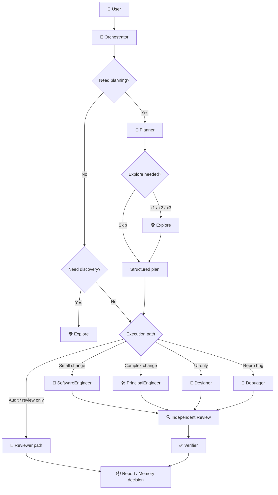
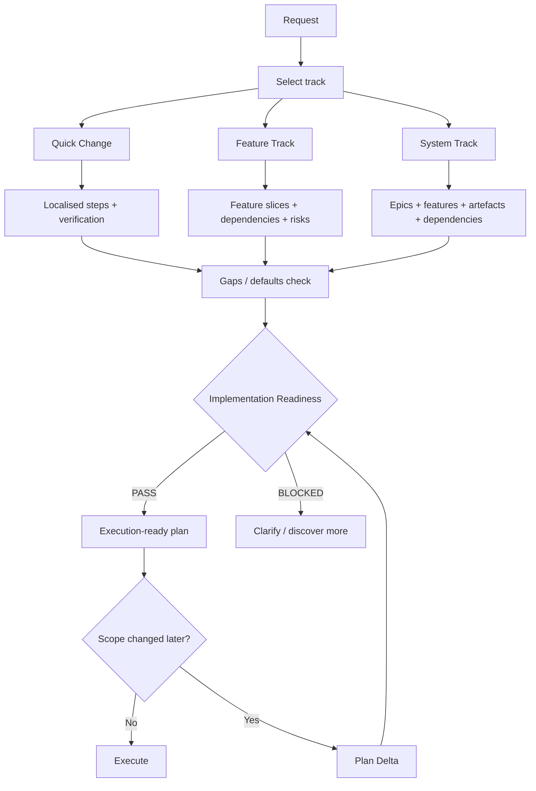
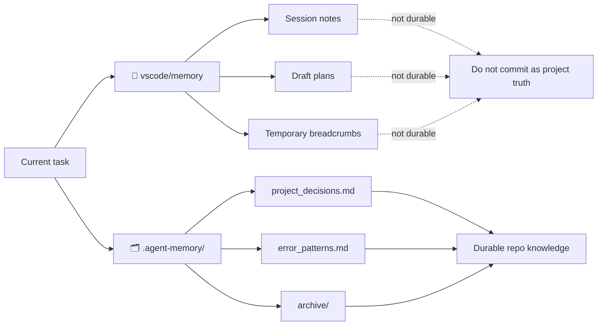

# 🚀 The Synthetic Engineer

**⚡ A disciplined multi-agent engineering system.**

This repo gives you a ready-to-adapt control plane for VS Code Agents:

- 🧭 one strong user-facing orchestrator instead of agent chaos
- 🧠 structured planning with tracks, epics, readiness gates, and plan deltas
- 🕵️ hidden specialist workers for coding, review, debugging, and discovery
- ✅ independent acceptance verification after review
- 🧰 reusable internal skills instead of bloated prompts
- 🗂️ template-based durable memory that downstream projects can safely adopt

## Architecture Docs

If you want the full system map instead of the short overview in this README, start with:

- [docs/architecture.md](docs/architecture.md) — end-to-end architecture, runtime flow, memory model, review/verification pipeline, and Pandora's Box integration
- [docs/README.md](docs/README.md) — documentation index

## 🔥 Features

- **🧠 Memory That Doesn’t Rot the Repo**: Durable knowledge goes to `.agent-memory/`; draft plans, breadcrumbs, and temporary context stay in session memory. You keep the benefits of memory without polluting a reusable open-source template.
- **🎛️ One Real Control Plane**: `Orchestrator` owns routing, review, debug loops, memory decisions, worktree strategy, and `/delegate` boundaries. This is not “a bag of agents” — it is a governed system.
- **✅ Independent Acceptance Gate**: `Verifier` validates changes after implementation and review using objective signals like tests, build/typecheck/lint, and targeted smoke checks. Passing review is not the same thing as being ready to close.
- **🕵️ Hidden Discovery Engine**: `Explore` gives you fast broad-to-narrow scouting, plus parallel `x2` / `x3` discovery for multi-surface tasks, while staying invisible to end users who should not call internal workers directly.
- **📐 Planning With Structure**: `Planner` works with explicit tracks — `Quick Change`, `Feature Track`, `System Track` — and produces plans with scope, slices/epics, dependencies, verification, gaps/defaults, and Multi-Hive decisions.
- **🛡️ Readiness Gates Before Code**: The system can block execution with `Implementation Readiness: BLOCKED` when scope is fuzzy, dependencies are missing, or verification is weak. It prefers clarity over fake momentum.
- **🔁 Plan Delta, Not Plan Thrash**: When scope changes mid-flight, the workflow can emit a `Plan Delta` instead of throwing away the whole plan and starting from zero.
- **🤖 Multi-Hive That Actually Scales**: For larger work, you can combine planning decomposition, hidden specialist agents, git worktrees for filesystem isolation, and `/delegate` for session isolation.

## Repository Layout

```text
project_root/
├── .agent-memory/
│   ├── project_decisions.md
│   ├── error_patterns.md
│   └── archive/
├── agents/
│   ├── orchestrator.agent.md
│   ├── planner.agent.md
│   ├── explore.agent.md
│   ├── software-engineer.agent.md
│   ├── principal-engineer.agent.md
│   ├── designer.agent.md
│   ├── reviewer.agent.md
│   ├── reviewer-gpt.agent.md
│   ├── reviewer-gemini.agent.md
│   ├── multi-reviewer.agent.md
│   ├── debugger.agent.md
│   └── verifier.agent.md
├── skills/
│   ├── planning-structure/
│   ├── research-discovery/
│   ├── memory-management/
│   └── ...
├── mcp/
│   └── pandoras-box/
├── docs/
│   └── architecture.md
└── ...
```

## Agent Model

### User-facing agents

- `agents/orchestrator.agent.md:1` — main entrypoint for execution, routing, review, and completion control
- `agents/planner.agent.md:1` — user-facing planning agent for discovery, clarification, and execution-ready plans

### Hidden internal agents

- `agents/explore.agent.md:1` — fast read-only scouting
- `agents/software-engineer.agent.md:1` — smaller implementation tasks
- `agents/principal-engineer.agent.md:1` — complex implementation tasks
- `agents/designer.agent.md:1` — UI-only implementation
- `agents/reviewer.agent.md:1` — single-review path
- `agents/reviewer-gpt.agent.md:1` — review subagent
- `agents/reviewer-gemini.agent.md:1` — review subagent
- `agents/multi-reviewer.agent.md:1` — consolidates multi-review output
- `agents/debugger.agent.md:1` — reproducible bug diagnosis and fix flow
- `agents/verifier.agent.md:1` — independent acceptance verification using objective checks

All internal agents are hidden with `user-invocable: false` and guarded with `disable-model-invocation: true`.

## Control Plane

### Orchestrator

`Orchestrator` is the sole control plane:

- never writes code directly
- performs only lightweight triage, routing, and governance
- delegates all file changes to coding/debug agents
- routes by task type and planning track
- decides when to use review, verification, debug, worktrees, and `/delegate`
- enforces memory-write policy for durable outcomes

`Orchestrator` is not a deep problem-framing agent:

- do not perform deep diagnosis, architecture design, or decomposition inside `Orchestrator`
- do not resolve ambiguous intent inside `Orchestrator` beyond minimal routing triage
- escalate immediately to `Planner` when the request has ambiguity, architectural choice, non-trivial decomposition, or unclear implementation readiness

It uses an explicit `agents` allowlist rather than implicit agent fan-out.

### Planner

`Planner` is the planning gatekeeper:

- clarifies ambiguous requests
- runs discovery directly or through `Explore`
- selects one planning track:
  - `Quick Change`
  - `Feature Track`
  - `System Track`
- emits structured plans with:
  - objective
  - scope
  - epics or feature slices
  - dependencies
  - verification
  - gaps and defaults
  - multi-hive decision
  - implementation readiness

`Planner` does not implement code.

### Explore

`Explore` is a hidden read-only subagent used when discovery materially improves routing or planning.

Routing policy:

- `SKIP` when owner and file scope are already clear
- `AUTO x1` for one primary research track
- `PARALLEL x2` for two mostly independent research tracks
- `PARALLEL x3` only for larger multi-surface planning or multi-hive decomposition

### Verifier

`Verifier` is a hidden non-authoring acceptance gate used after implementation and review.

It:

- runs objective checks such as tests, lint, typecheck, builds, and targeted smoke verification
- validates readiness using executed signals rather than code inspection
- returns `Verification Verdict: PASS` or `BLOCKED`
- stays independent from the coding/debugging agent that produced the patch

## Architecture Diagrams

### Control plane



## Planning Model

Planning now follows explicit structure instead of ad hoc step lists.

### Tracks

- `Quick Change` — localised low-ambiguity work
- `Feature Track` — medium work with a few moving parts
- `System Track` — architecture, integration, or multi-surface work

### Required planning concepts

- `Clarification Status`
- `Planning Track`
- `Objective`
- `Scope`
- `Epics` or `Feature Slices`
- `Ordered implementation steps`
- `Verification`
- `Implementation Readiness`
- `Memory Update`
- `Multi-Hive Decision`
- `Gaps and Proposed Defaults`
- the `Documentation Artifacts` section for larger system work

### Readiness gate

Execution should not start unless the plan is ready:

- scope is stable enough
- affected areas are known
- dependencies are known
- verification is concrete
- critical gaps are resolved

If not, the plan must return `Implementation Readiness: BLOCKED`.

### Plan delta

If scope changes after a plan already exists, the preferred behaviour is a `Plan Delta`:

- what changed
- what remains valid
- what steps are removed
- what new steps are added
- whether routing or readiness changed

### Planning flow



## Execution and Routing

### Default routing

- planning / ambiguity / architecture / decomposition → `Planner`
- fast scouting → `Explore`
- small implementation → `SoftwareEngineer`
- complex implementation → `PrincipalEngineer`
- UI-only implementation → `Designer`
- review / audit → `Reviewer` or multi-review path
- reproducible failure → `Debugger`
- acceptance verification → `Verifier`

Routing rule:

- if the request is ambiguous, requires architectural judgement, needs decomposition, or is not implementation-ready, `Orchestrator` must hand off to `Planner` instead of framing the problem itself

### Review paths

- single review → `Reviewer`
- multi-review → `ReviewerGPT` + `ReviewerGemini` + `Reviewer` in parallel, then `MultiReviewer`

### Acceptance verification

- after non-trivial implementation or verified bugfix, run independent review first
- after review and any follow-up fixes, run `Verifier`
- close the task only after `Verifier` passes, unless a justified skip rule applies

### `/delegate`

Use `/delegate` for stable phase handoff when session isolation is useful:

- long-running implementation
- terminal-heavy work
- debugging loops
- larger multi-file refactors
- multi-hive branches

Do not use `/delegate` for trivial microtasks.

## Skills

Skills in this repo are internal operational guides, not public menu items.

For a concise catalogue of available skills and when to use each one, see
[`./skills/README.md`](skills/README.md).

Important skills:

- `skills/planning-structure/SKILL.md:1` — planning tracks, epics, readiness gate, plan delta
- `skills/research-discovery/SKILL.md:1` — broad-to-narrow discovery
- `skills/memory-management/SKILL.md:1` — durable vs session memory rules
- `skills/git-worktree/SKILL.md:1` — filesystem isolation for parallel work
- `skills/review-core/SKILL.md:1` — shared review contract
- `skills/review-orchestration/SKILL.md:1` — independent review gate, review routing, and optimisation follow-up
- `skills/multi-model-review/SKILL.md:1` — consensus-based multi-model finding consolidation

Default rule: skills should generally remain hidden with `user-invocable: false`.

## Memory Model

The repository uses a two-layer memory model:

- durable memory in `.agent-memory/project_decisions.md:1` and `.agent-memory/error_patterns.md:1`
- session memory in `vscode/memory`

Rules:

- durable project knowledge goes only into `.agent-memory/`
- session notes, draft plans, and temporary breadcrumbs stay in `vscode/memory`
- draft epics, tentative feature breakdowns, and plan deltas are not durable by default

For this open-source repository, `.agent-memory/` is committed as a template:

- instructions and entry templates stay in git
- project-specific memory entries should be added only in downstream projects
- reusable template repos should keep these files empty except for guidance

### Memory model



## Worktrees and Multi-Hive

Use git worktrees when parallel tasks require filesystem isolation, especially if overlapping files make normal parallel delegation unsafe.

Use Multi-Hive only when it is justified by the task:

- multiple independent subsystems
- high conflict risk
- high task volume
- strong need for environment isolation

Worktrees and `/delegate` solve different problems:

- worktrees provide filesystem isolation
- `/delegate` provides session isolation

They can be combined.

## Recommended Adoption

If you clone this repository into another project:

1. keep `.agent-memory/*.md` as templates initially
2. customise agent instructions for your repo structure and tooling
3. expose only the agents you want users to call directly
4. keep internal workers and skills hidden by default
5. tune planning tracks and review thresholds for your project size

## References

- [GitHub Copilot Agents overview](https://code.visualstudio.com/docs/copilot/agents/overview)
- [Subagents](https://code.visualstudio.com/docs/copilot/agents/subagents)
- [Memory](https://code.visualstudio.com/docs/copilot/agents/memory)
- [Cloud agents](https://code.visualstudio.com/docs/copilot/agents/cloud-agents)
