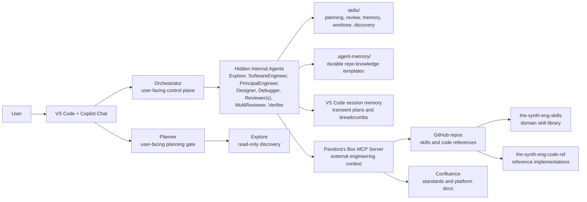
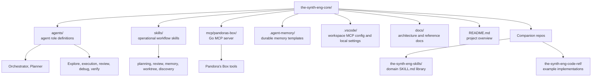
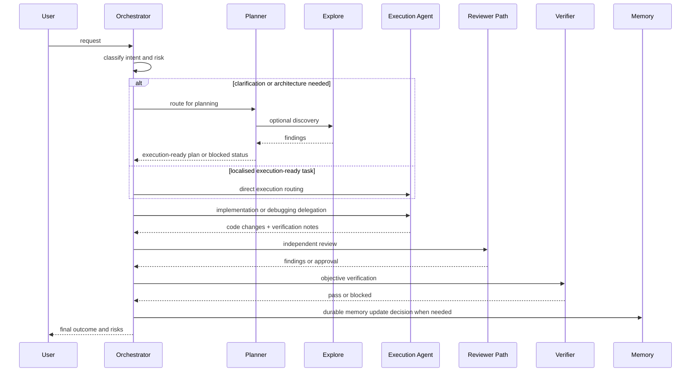
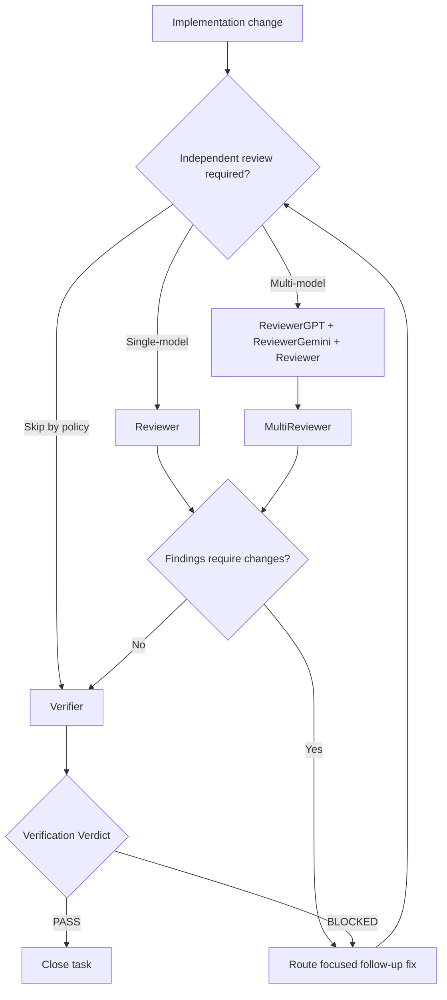
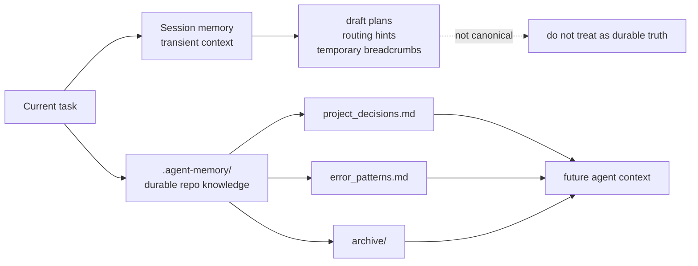
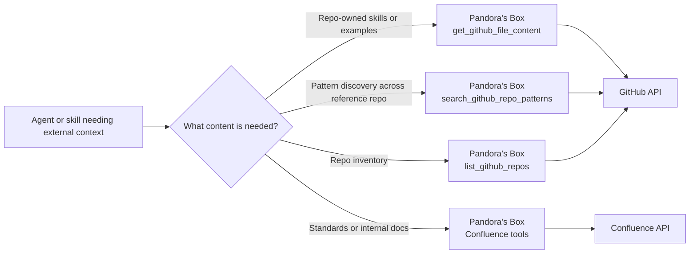

# Architecture

This document explains what the The Synthetic Engineer core repo does, how the main parts fit together, and how work moves through the system.

It also explains how `the-synth-eng-core` relates to the companion repositories `the-synth-eng-skills` and `the-synth-eng-code-ref`.

## Purpose

The repository is a control plane for VS Code agent workflows. It provides:

- user-facing coordination through `Orchestrator` and `Planner`
- specialised hidden execution agents for coding, review, debugging, and verification
- reusable operational skills that define planning, review, memory, and worktree policy
- durable repo memory templates under `.agent-memory/`
- the `Pandora's Box` MCP server for external engineering context from Confluence and GitHub

Within the broader Synthetic Engineer system, this repo is the coordinator rather than the full knowledge base. The surrounding repositories provide complementary inputs:

- `the-synth-eng-core`: the control plane, agent definitions, orchestration policy, repo-local memory rules, and external-context adapter
- `the-synth-eng-skills`: the domain-skill library that holds specialist implementation and review guidance across areas such as API design, frontend architecture, Go practices, testing, and security
- `the-synth-eng-code-ref`: the example and pattern library that gives agents concrete reference implementations they can inspect before planning or coding

The system is designed to keep responsibilities explicit:

- coordination is separated from implementation
- review is separated from authorship
- verification is separated from review
- durable memory is separated from transient session context

## System Context

## Repository Roles in the System

The Synthetic Engineer is split across three repos on purpose so that orchestration, reusable guidance, and example implementations can evolve independently.

### `the-synth-eng-core`

This repo is the control plane. It owns:

- user-facing and hidden agent definitions
- workflow skills for planning, review, memory, discovery, and worktree usage
- repo-level architecture and operating rules
- Pandora's Box as the retrieval boundary to external context

This is the repo that decides how work is routed and governed.

### `the-synth-eng-skills`

This repo is the domain-skill library. It owns specialist `SKILL.md` files that expand the system beyond the core operational workflow. In the current workspace it includes areas such as:

- API design
- code quality
- frontend architecture and design
- Go best practice and hexagonal architecture
- Node.js, Docker, Kubernetes, and NGINX guidance
- security and testing guidance
- TypeScript implementation patterns

The core repo does not duplicate that content. Instead, agents either read those files locally when the repo is checked out or fetch them through Pandora's Box when they are remote.

### `the-synth-eng-code-ref`

This repo is the implementation reference library. It contains small examples and pattern repos that agents can inspect for concrete structure before proposing or writing code. In the current workspace it includes reference areas such as:

- `api-design/example` for API-oriented Go structure
- `go-hexagonal-architecture/example` for ports-and-adapters patterns
- `typescript-basic/example` for a small runnable TypeScript frontend example

The purpose of this repo is not orchestration policy. Its role is to provide trustworthy, repo-owned examples that can anchor planning and implementation decisions.

## Core Components

### User-facing agents

- `Orchestrator`: the main manager. It triages requests, routes work, controls review and verification, and decides when memory or worktrees are needed.
- `Planner`: the planning gatekeeper. It handles ambiguity, discovery, decomposition, and execution readiness.

### Hidden internal agents

- `Explore`: read-only discovery for codebase mapping and pattern lookup.
- `SoftwareEngineer`: execution agent for smaller implementation tasks.
- `PrincipalEngineer`: execution agent for larger or riskier implementation tasks.
- `Designer`: UI and UX-only execution path.
- `Debugger`: minimal root-cause bug fixing for reproducible failures.
- `Reviewer`, `ReviewerGPT`, `ReviewerGemini`: independent review producers.
- `MultiReviewer`: consolidation layer for multi-model review.
- `Verifier`: objective acceptance gate based on commands, tests, builds, and smoke checks.

### Skills

The `skills/` directory holds operational policy and reusable workflow guidance rather than user-facing features. Current core skills cover:

- planning structure
- research and discovery
- review contracts and orchestration
- multi-model review consolidation
- durable memory governance
- git worktree strategy

These are the core workflow skills only. Domain-specific skills live in `the-synth-eng-skills`, which the agents consult when the task needs deeper guidance than the control-plane repo should carry inline.

### Durable memory

The repo commits `.agent-memory/` as reusable templates. The files define the durable memory shape, but downstream projects populate the project-specific entries.

### Pandora's Box MCP server

`mcp/pandoras-box` is a Go MCP server that exposes external engineering context to agents. It currently supports:

- environment inspection
- Confluence search and page retrieval
- GitHub repo listing
- GitHub file-content retrieval
- GitHub repository pattern search

This gives agents a structured alternative to raw web browsing for repo-owned skills, reference examples, and platform guidance.

In practice, Pandora's Box is the bridge between this control-plane repo and the companion repositories when they are not already present in the local workspace.

## Cross-Repo Knowledge Flow

The three repositories fit together as a layered system:

1. `the-synth-eng-core` decides how work should be planned, routed, reviewed, and verified.
2. `the-synth-eng-skills` supplies specialist guidance that shapes implementation and review decisions for a particular domain.
3. `the-synth-eng-code-ref` supplies example code and structural patterns that the planner or execution agents can reuse or adapt.

This creates a deliberate separation of concerns:

- policy and orchestration live in the core repo
- reusable domain knowledge lives in the skills repo
- concrete implementation patterns live in the reference repo

## Repository Structure

## Request Lifecycle

The system uses a staged flow rather than allowing every agent to do everything.

## Routing and Decision Model

The control plane is intentionally asymmetric:

- `Orchestrator` governs but does not write code
- `Planner` clarifies and decomposes but does not implement
- execution agents write code but should not own product ambiguity
- reviewers inspect but do not implement
- `Verifier` validates closure based on executed evidence, not opinion

This separation prevents a single prompt from quietly becoming planner, implementer, reviewer, and verifier all at once.

## Planning and Readiness

Planning has three explicit tracks:

- `Quick Change`: small, localised work
- `Feature Track`: medium complexity work with a few moving parts
- `System Track`: architecture, integration, or multi-surface work

Each plan is expected to define:

- objective
- scope and exclusions
- ordered implementation steps
- verification
- gaps/defaults
- multi-hive decision
- implementation readiness

Execution should not begin when readiness is blocked.

## Review and Verification Pipeline

Review and verification are separate gates.

Key consequence:

- passing review is not enough to close a task
- passing verification is the default closure gate for non-trivial work

## Memory Model

The system keeps durable and transient context separate.

Rules:

- durable repo knowledge belongs only in `.agent-memory/`
- session memory is useful for continuity but not canonical truth
- repo memory is kept git-tracked and portable instead of using expiring workspace-only memory

## Pandora's Box in the Architecture

Pandora's Box is the external context adapter for this repo.

Preferred retrieval order:

1. local workspace file when the repo is already checked out
2. Pandora's Box when the content lives in GitHub or Confluence
3. `context7` for external library and framework documentation
4. generic web fetch only for non-repository, non-library pages

Applied to the three-repo system, that means:

1. use local files from `the-synth-eng-core`, `the-synth-eng-skills`, or `the-synth-eng-code-ref` when those repos are checked out in the workspace
2. use Pandora's Box to fetch files or patterns from `the-synth-eng-skills` and `the-synth-eng-code-ref` when they are not local
3. use `context7` only for third-party library and framework documentation that is not repo-owned

## What the System Optimises For

The design optimises for:

- explicit ownership boundaries
- clear readiness before execution
- independent review and verification
- durable operational knowledge without polluting product repos
- scalable delegation using worktrees and hidden specialists
- structured external retrieval through Pandora's Box

It does not optimise for:

- fully autonomous uncontrolled agent fan-out
- implicit tool usage without governance
- treating transient session memory as project truth
- closing tasks on code inspection alone without objective verification

## Suggested Reading Order

If you are new to the repo, read in this order:

1. `README.md`
2. `docs/architecture.md`
3. `agents/orchestrator.agent.md`
4. `agents/planner.agent.md`
5. `skills/README.md`
6. `mcp/pandoras-box/README.md`

That sequence gives you the top-level model first, then the concrete routing, policy, and external-context layers.

If you are trying to understand the full multi-repo system rather than only this repo, continue with:

7. `../the-synth-eng-skills/skills/README.md`
8. one or two relevant domain skill files from `the-synth-eng-skills`
9. a matching example under `../the-synth-eng-code-ref/`

That second pass shows how orchestration policy in the core repo connects to domain guidance and concrete implementation patterns in the companion repos.