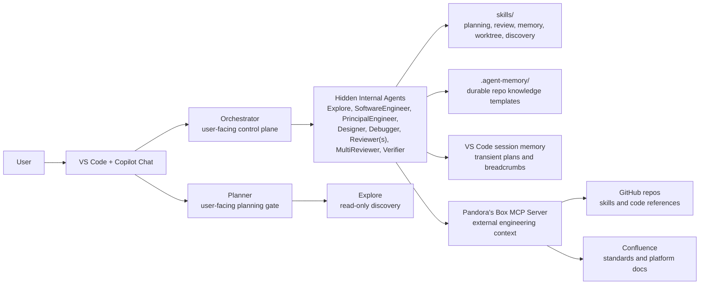
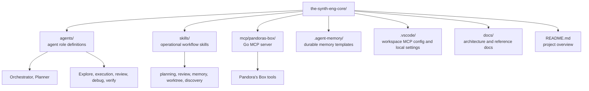
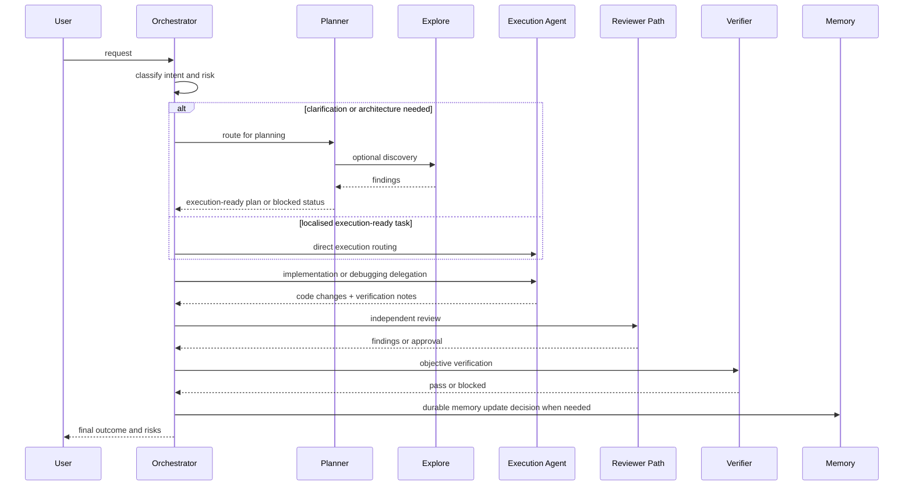
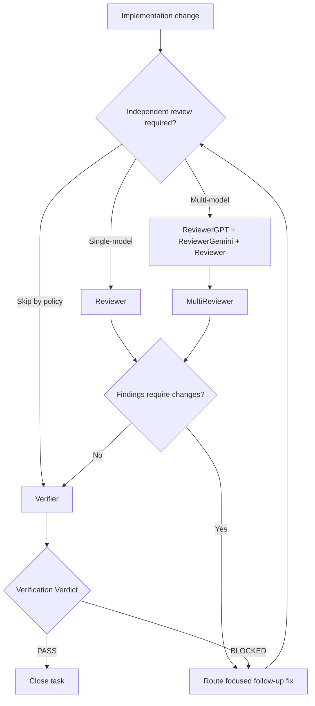
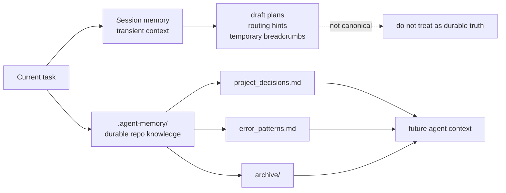
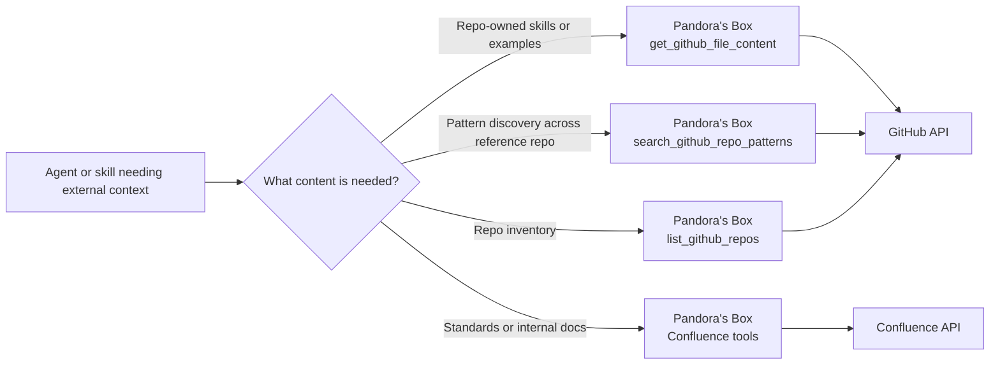

# Architecture

This document explains what the The Synthetic Engineer core repo does, how the main parts fit together, and how work moves through the system.

## Purpose

The repository is a control plane for VS Code agent workflows. It provides:

- user-facing coordination through `Orchestrator` and `Planner`
- specialised hidden execution agents for coding, review, debugging, and verification
- reusable operational skills that define planning, review, memory, and worktree policy
- durable repo memory templates under `.agent-memory/`
- the `Pandora's Box` MCP server for external engineering context from Confluence and GitHub

The system is designed to keep responsibilities explicit:

- coordination is separated from implementation
- review is separated from authorship
- verification is separated from review
- durable memory is separated from transient session context

## System Context

## Core Components

### User-facing agents

- `Orchestrator`: the main manager. It triages requests, routes work, controls review and verification, and decides when memory or worktrees are needed.
- `Planner`: the planning gatekeeper. It handles ambiguity, discovery, decomposition, and execution readiness.

### Hidden internal agents

- `Explore`: read-only discovery for codebase mapping and pattern lookup.
- `SoftwareEngineer`: execution agent for smaller implementation tasks.
- `PrincipalEngineer`: execution agent for larger or riskier implementation tasks.
- `Designer`: UI and UX-only execution path.
- `Debugger`: minimal root-cause bug fixing for reproducible failures.
- `Reviewer`, `ReviewerGPT`, `ReviewerGemini`: independent review producers.
- `MultiReviewer`: consolidation layer for multi-model review.
- `Verifier`: objective acceptance gate based on commands, tests, builds, and smoke checks.

### Skills

The `skills/` directory holds operational policy and reusable workflow guidance rather than user-facing features. Current core skills cover:

- planning structure
- research and discovery
- review contracts and orchestration
- multi-model review consolidation
- durable memory governance
- git worktree strategy

### Durable memory

The repo commits `.agent-memory/` as reusable templates. The files define the durable memory shape, but downstream projects populate the project-specific entries.

### Pandora's Box MCP server

`mcp/pandoras-box` is a Go MCP server that exposes external engineering context to agents. It currently supports:

- environment inspection
- Confluence search and page retrieval
- GitHub repo listing
- GitHub file-content retrieval
- GitHub repository pattern search

This gives agents a structured alternative to raw web browsing for repo-owned skills, reference examples, and platform guidance.

## Repository Structure

## Request Lifecycle

The system uses a staged flow rather than allowing every agent to do everything.

## Routing and Decision Model

The control plane is intentionally asymmetric:

- `Orchestrator` governs but does not write code
- `Planner` clarifies and decomposes but does not implement
- execution agents write code but should not own product ambiguity
- reviewers inspect but do not implement
- `Verifier` validates closure based on executed evidence, not opinion

This separation prevents a single prompt from quietly becoming planner, implementer, reviewer, and verifier all at once.

## Planning and Readiness

Planning has three explicit tracks:

- `Quick Change`: small, localised work
- `Feature Track`: medium complexity work with a few moving parts
- `System Track`: architecture, integration, or multi-surface work

Each plan is expected to define:

- objective
- scope and exclusions
- ordered implementation steps
- verification
- gaps/defaults
- multi-hive decision
- implementation readiness

Execution should not begin when readiness is blocked.

## Review and Verification Pipeline

Review and verification are separate gates.

Key consequence:

- passing review is not enough to close a task
- passing verification is the default closure gate for non-trivial work

## Memory Model

The system keeps durable and transient context separate.

Rules:

- durable repo knowledge belongs only in `.agent-memory/`
- session memory is useful for continuity but not canonical truth
- repo memory is kept git-tracked and portable instead of using expiring workspace-only memory

## Pandora's Box in the Architecture

Pandora's Box is the external context adapter for this repo.

Preferred retrieval order:

1. local workspace file when the repo is already checked out
2. Pandora's Box when the content lives in GitHub or Confluence
3. `context7` for external library and framework documentation
4. generic web fetch only for non-repository, non-library pages

## What the System Optimises For

The design optimises for:

- explicit ownership boundaries
- clear readiness before execution
- independent review and verification
- durable operational knowledge without polluting product repos
- scalable delegation using worktrees and hidden specialists
- structured external retrieval through Pandora's Box

It does not optimise for:

- fully autonomous uncontrolled agent fan-out
- implicit tool usage without governance
- treating transient session memory as project truth
- closing tasks on code inspection alone without objective verification

## Suggested Reading Order

If you are new to the repo, read in this order:

1. `README.md`
2. `docs/architecture.md`
3. `agents/orchestrator.agent.md`
4. `agents/planner.agent.md`
5. `skills/README.md`
6. `mcp/pandoras-box/README.md`

That sequence gives you the top-level model first, then the concrete routing, policy, and external-context layers.