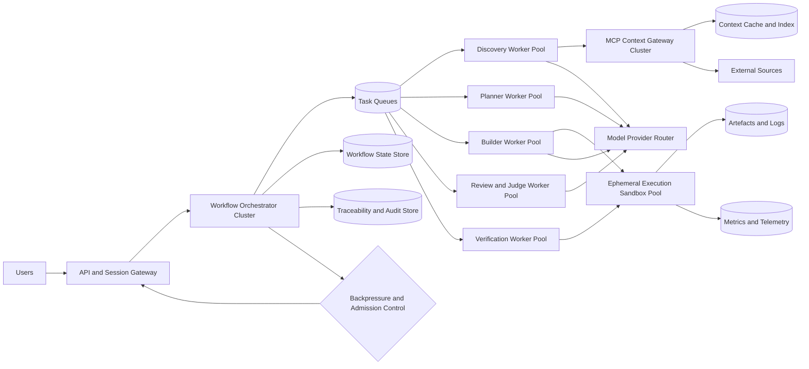

# Scaling Design

This document extends the whiteboard architecture into an operational scaling design. It focuses on how the Synthetic Engineer should scale under higher concurrency, larger task sizes, and heavier retrieval and validation workloads, and it highlights the primary bottlenecks that will appear first.

The intent is not to change the control-plane principles from [architecture.md](architecture.md) and [whiteboard-architecture.md](whiteboard-architecture.md). The intent is to show how those principles can survive real system growth.

## Goals

* Preserve clear separation between planning, implementation, review, and verification
* Scale concurrent user requests without turning the system into a single hot control plane
* Isolate expensive workloads such as model inference, repository indexing, benchmarking, and judge fan-out
* Maintain traceability, auditability, and reproducibility under load
* Degrade predictably with backpressure instead of silently dropping quality

## Workload Model

The dominant scaling challenge is not simple HTTP request volume. It is workflow amplification.

One user request can expand into:

* one planning pass
* one or more discovery passes
* multiple code-generation loops
* build, test, lint, and benchmark execution
* independent review and verification passes
* traceability, assumption, and audit writes at each stage

That means the effective system load is closer to:

$$
\text{system load} = \text{incoming requests} \times \text{average workflow fan-out} \times \text{average retry depth}
$$

For this architecture, the first-order capacity model is:

$$
\text{max concurrent workflows} \approx \min(
\text{orchestration slots},
\text{model throughput},
\text{executor capacity},
\text{retrieval throughput},
\text{state-store write capacity}
)
$$

## Main Scaling Principle

The current whiteboard view is logically correct, but it is still visually centralised. In production, the system should scale as a set of planes with queues and state boundaries between them.

* control plane: request intake, workflow state transitions, policy, routing
* cognition plane: planner, discovery, coding, review, judge model invocations
* execution plane: builds, tests, benchmarks, sandboxed runs
* data plane: context retrieval, indexes, artefacts, traces, assumptions, telemetry

Each plane should scale independently and fail independently.

## Target Scaling Topology

## Component-by-Component Scaling Design

### 1. API and Session Gateway

Responsibilities:

* authenticate users and agents
* create workflow sessions
* stream status and partial outputs
* apply tenant or team quotas

How it scales:

* keep the gateway stateless
* store workflow state outside the request path
* use sticky session only for streamed UX, not for correctness
* separate interactive streaming connections from background workflow execution

Potential bottlenecks:

* too many long-lived streaming connections on the same nodes
* coupling synchronous request timeouts to long-running jobs
* per-tenant noisy-neighbor effects

Mitigation:

* split ingest and stream fan-out from workflow scheduling
* terminate streams at a dedicated gateway tier
* use explicit workflow IDs and resumable event streams

### 2. Workflow Orchestrator Cluster

Responsibilities:

* maintain workflow state machine
* schedule the next step based on execution results
* enforce retries, hard stops, and policy checks
* route remediation to the correct subsystem

How it scales:

* run multiple orchestrator replicas behind a shared durable state store
* make step execution idempotent
* drive work through queues instead of in*memory callbacks
* represent each workflow as explicit state transitions, not implicit agent conversations

Potential bottlenecks:

* a single orchestrator instance becoming the serialisation point for all workflows
* lock contention on workflow state rows or documents
* retry storms when a downstream dependency is degraded

Mitigation:

* shard workflow ownership by workflow ID
* use optimistic concurrency with versioned workflow state
* implement capped retries with exponential backoff and circuit breaking
* allow partial workflow suspension when one subsystem is unhealthy

### 3. Task Queues

Responsibilities:

* decouple control*plane decisions from execution timing
* absorb bursts
* isolate slow worker pools from fast ones

How it scales:

* use separate queues by workload class: discovery, planning, coding, review, verification
* assign per*queue concurrency and fairness controls
* support priority lanes for short interactive work versus batch work

Potential bottlenecks:

* one global queue mixing cheap and expensive tasks
* head-of-line blocking from benchmark or judge jobs
* unbounded queue growth hiding real overload

Mitigation:

* enforce per-class queue depth limits
* reject or defer low-priority work under pressure
* surface queue lag as a product-level signal, not an internal-only metric

### 4. MCP Context Gateway and Retrieval Plane

Responsibilities:

* retrieve context from GitHub, Confluence, local workspace, and reference sources
* normalise and rank results
* resolve conflicts between sources

How it scales:

* run the gateway as a horizontally scalable stateless service
* cache fetched documents and derived embeddings or indexes
* pre-index frequently used repositories and skills
* separate online retrieval from background indexing

Potential bottlenecks:

* the MCP gateway becoming a hot shared dependency for every workflow stage
* repeated cold fetches of the same skill or reference files
* rate limits and latency spikes from GitHub or Confluence
* expensive conflict-resolution logic on the critical path

Mitigation:

* add a two-level cache: raw document cache plus normalised context cache
* precompute repository summaries and file maps for common sources
* fall back to stale-but-known-good cache on external dependency degradation
* make conflict resolution deterministic and cheap where possible

### 5. Planner, Builder, Review, and Judge Worker Pools

Responsibilities:

* invoke models for planning, generation, review, and evaluation
* translate workflow state into bounded model tasks
* return structured outputs rather than freeform transcripts

How it scales:

* split worker pools by task type and model profile
* route high-context tasks to large-reasoning models and routine tasks to cheaper models
* cap token budgets and context window growth per stage
* cache reusable reasoning artefacts such as repository maps and discovery summaries

Potential bottlenecks:

* model-provider throughput and rate limits
* runaway prompt growth across long workflows
* expensive multi-judge fan-out on every iteration
* tight coupling to a single model vendor

Mitigation:

* introduce a model router with policy-based fallback
* summarise intermediate state aggressively before handing off stages
* apply judge fan-out only at defined gates, not after every micro-change
* keep a hard budget for tokens, latency, and retries per workflow

### 6. Execution and Verification Sandbox Pool

Responsibilities:

* build code
* run tests, linters, benchmarks, and smoke checks
* isolate dependencies and filesystem state

How it scales:

* use ephemeral sandboxes or workers per task
* cache language dependencies, toolchains, and repository clones
* run short checks and long benchmarks in separate pools
* constrain CPU, memory, network, and wall-clock per job

Potential bottlenecks:

* benchmark jobs starving routine verification
* repository checkout and dependency install overhead dominating runtime
* noisy-neighbor effects on shared compute hosts
* excessive artefact retention costs

Mitigation:

* split verification into fast gate and deep gate tiers
* warm common language runtimes and dependency caches
* use content-addressed caches for repository state and build outputs
* enforce retention policies for logs, artefacts, and benchmark traces

### 7. Traceability, Assumption, and Audit Stores

Responsibilities:

* record requirement contracts, plan outputs, code mappings, test evidence, judgments, assumptions, and run logs
* support audit and replay

How it scales:

* separate hot workflow state from append-heavy evidence storage
* use append-only event records for history
* derive denormalised read models for operator and user views

Potential bottlenecks:

* treating traceability as a transactional dependency for every step
* large graph updates becoming synchronous blockers
* audit-log volume exploding with verbose intermediate artefacts

Mitigation:

* write critical step metadata synchronously and bulk evidence asynchronously
* use immutable event streams plus periodic graph materialisation
* tier storage: hot metadata, warm evidence, cold archive

## Concrete Technology Recommendations

The architecture should stay portable, but portability does not mean avoiding implementation choices. A practical reference stack makes the design executable and gives teams a sensible default path.

The recommendations below are split into default choice, acceptable alternatives, and the reason each layer fits this system.

### 1. API and Session Gateway

Recommended default:

* Go service for API and session handling
* Envoy or NGINX as the edge proxy
* gRPC for internal service-to-service calls
* Server-Sent Events or WebSockets for user workflow streaming

Acceptable alternatives:

* TypeScript with Fastify for the gateway if the surrounding platform is already Node-heavy
* GraphQL only for user-facing aggregation, not for internal workflow transport

Why this fits:

* Go matches the repo's MCP server direction and is strong for concurrency, streaming, and lower operational overhead
* Envoy or NGINX give mature connection handling, rate limiting, and traffic policy
* gRPC keeps internal workflow messages typed and bounded

### 2. Workflow Orchestrator Cluster

Recommended default:

* Temporal as the workflow engine
* Go workers for orchestration logic and long-running workflow execution
* PostgreSQL for Temporal persistence in earlier phases, then managed scalable backing stores as load grows

Acceptable alternatives:

* Cadence if Temporal is not available in the target environment
* A custom orchestrator only if the workflow requirements remain modest and replay, retries, and visibility are not yet complex

Why this fits:

* the architecture is explicitly stateful, retry-aware, and event-driven, which is exactly the category Temporal handles well
* durable workflow history, step retries, timers, and replay reduce the need to rebuild distributed systems mechanics from scratch

### 3. Task Queues

Recommended default:

* Temporal task queues for workflow-owned execution
* NATS JetStream for lighter event fan-out and internal decoupled messaging outside core workflow state

Acceptable alternatives:

* Kafka when event throughput, retention, and downstream replay become primary concerns
* SQS or Pub/Sub when deploying deeply into a single cloud provider

Why this fits:

* Temporal queues are the cleanest match for workflow step dispatch
* NATS gives low-latency operational messaging without forcing everything into a heavy streaming platform too early
* Kafka is strong, but it is usually justified later than teams assume for this class of system

### 4. Workflow State Store

Recommended default:

* PostgreSQL for workflow metadata, quotas, and operational read models
* Redis for short-lived coordination data, rate-limit counters, and hot ephemeral state

Acceptable alternatives:

* CockroachDB if multi-region SQL semantics matter early
* FoundationDB only if the team already has deep operating experience with it

Why this fits:

* PostgreSQL is the safest default for correctness, tooling, and maintainability
* Redis is useful for latency-sensitive ephemeral state, but should not become the system of record for workflows

### 5. MCP Context Gateway and Retrieval Plane

Recommended default:

* Go service for the MCP gateway
* PostgreSQL with pgvector for metadata and embedding-backed retrieval
* OpenSearch for full-text and document search across indexed repos and docs
* Redis for hot document and query-result caching

Acceptable alternatives:

* Elasticsearch instead of OpenSearch if that is already standard internally
* Weaviate or Qdrant if vector retrieval requirements outgrow pgvector

Why this fits:

* the retrieval plane needs both keyword and semantic search, not semantic search alone
* pgvector is a strong starting point for moderate scale and simpler operations
* OpenSearch gives a mature path for relevance tuning, faceting, and large text indexes

### 6. Planner, Builder, Review, and Judge Workers

Recommended default:

* Go or Python workers depending on model SDK maturity and internal standards
* a model router layer that normalises providers and enforces policy, budget, and fallback rules
* structured prompt input and output contracts stored as versioned schemas

Acceptable alternatives:

* TypeScript workers where existing internal AI platform tooling is already Node-based
* provider-native orchestration only for prototypes, not the main production control plane

Why this fits:

* the critical requirement is not language purity; it is provider abstraction, typed stage boundaries, and cost controls
* Python often wins for model ecosystem breadth, while Go is attractive for system integration and operational simplicity

Suggested router implementations:

* an internal router service if provider policy is a strategic capability
* LiteLLM if fast provider normalisation is more important than building that layer immediately

### 7. Execution and Verification Sandbox Pool

Recommended default:

* Kubernetes for scheduling isolated execution workers
* ephemeral containers per job
* Firecracker-backed microVMs for stronger isolation in higher-trust or multi-tenant environments
* BuildKit and language-specific dependency caches for repeatable build acceleration

Acceptable alternatives:

* Nomad if the platform team already runs it well
* plain containers only in lower-risk single-tenant environments

Why this fits:

* verification workloads are bursty, CPU-heavy, and isolation-sensitive
* Kubernetes provides the most flexible scheduling and autoscaling baseline
* microVM isolation becomes important once untrusted or partially trusted code execution is routine

### 8. Artefacts, Logs, and Benchmark Output

Recommended default:

* S3-compatible object storage for logs, traces, artefacts, benchmark results, and packaged outputs
* lifecycle policies for hot, warm, and cold retention tiers

Acceptable alternatives:

* cloud-native blob storage equivalents where object lifecycle management is already standardised

Why this fits:

* these outputs are append-heavy, large, and poorly suited to transactional databases
* object storage is the cleanest fit for evidence retention and replay support

### 9. Traceability, Assumption, and Audit Data

Recommended default:

* PostgreSQL for canonical requirement, plan, run, and assumption metadata
* object storage for bulky evidence payloads
* OpenSearch for operator-facing audit search
* Neo4j only if graph traversal becomes a real product requirement rather than a conceptual preference

Acceptable alternatives:

* JanusGraph or Neptune if graph-native audit exploration becomes central and the operating model supports it

Why this fits:

* many teams overreach into graph databases too early
* the traceability model can usually start as relational metadata plus derived links, with graph materialisation added later if query patterns truly demand it

### 10. Observability and Operational Telemetry

Recommended default:

* OpenTelemetry for traces, metrics, and logs
* Prometheus for metrics
* Grafana for dashboards and alerting views
* Tempo or Jaeger for tracing
* Loki for log aggregation where a lightweight stack is preferred

Acceptable alternatives:

* Datadog or New Relic if the organisation already standardises on a commercial observability platform

Why this fits:

* the system needs stage-level latency, retry depth, queue lag, model fallback, cache hit rate, and verification runtime visibility
* OpenTelemetry keeps instrumentation portable even if the backend changes later

### 11. Identity, Secrets, and Policy Controls

Recommended default:

* OIDC-based identity integration
* Vault or cloud-native secret management
* OPA for policy enforcement on workflow admission, tenant constraints, and tool access

Acceptable alternatives:

* cloud-native IAM and policy engines when the deployment target is intentionally single-cloud

Why this fits:

* the architecture already assumes hard-stop conditions and policy guardrails
* those guardrails need enforceable policy, not only prompt instructions

## Reference Stack by Phase

If a single recommended stack is needed for implementation planning, this is the cleanest starting point.

### Phase 1 reference stack

* API and gateway: Go plus Envoy
* workflow engine: Temporal
* metadata store: PostgreSQL
* cache and ephemeral coordination: Redis
* retrieval search: PostgreSQL plus pgvector
* execution pool: Kubernetes jobs
* artefacts: S3-compatible object storage
* telemetry: OpenTelemetry plus Prometheus plus Grafana

### Phase 2 additions

* add OpenSearch for large-scale retrieval and audit search
* add NATS JetStream for non-workflow event fan-out
* add LiteLLM or an internal model router for budget-aware routing and provider fallback
* add Firecracker-backed isolation for higher-risk execution workloads

### Phase 3 additions

* move to multi-region orchestration and replicated caches
* add stronger workflow sharding and regional sandbox placement
* consider graph materialisation or a graph database only if traceability queries justify it

## Primary Bottlenecks

The likely bottlenecks, in order of impact, are below.

### 1. Centralised orchestration

If the orchestrator remains a single logical process, it will become the first hard scale ceiling. The architecture depends on frequent feedback loops, remediation routing, and state transitions. That creates high coordination pressure even before model or execution cost dominates.

### 2. Shared retrieval gateway

The MCP Context Gateway is on the critical path for HSI, discovery, planning, and build. Without caching and pre-indexing, retrieval latency multiplies across every workflow stage.

### 3. Model throughput and token growth

LLM-heavy systems usually hit provider throughput, latency, and cost limits before classic CPU saturation. Long-running workflows also accumulate context, which creates a nonlinear latency and cost curve.

### 4. Verification and benchmark capacity

Execution workloads are materially more expensive than control-plane routing. If benchmarks and deep integration tests share the same pool as routine checks, verification latency will dominate end-to-end cycle time.

### 5. Traceability write amplification

The architecture requires full traceability. If every intermediate artefact is synchronously written into a single graph-oriented store, the data plane will become a bottleneck and increase workflow latency.

### 6. Retry storms during partial outages

The self-correcting loop is a strength, but under degraded dependencies it can amplify load. A bad model provider window or external retrieval outage can trigger repeated remediation cycles unless admission control and retry policies are strict.

### 7. External dependency rate limits

GitHub, Confluence, package registries, and model vendors all impose throughput constraints. These systems will not scale with the control plane unless the design explicitly assumes partial unavailability and cached operation.

## Recommended Runtime Pattern

The most robust implementation pattern is event-driven orchestration with durable workflow state.

Recommended properties:

* each workflow step is a durable command with a typed result
* each worker is stateless beyond its local cache
* workflow progression is event-driven, not thread-held
* retries happen at the step level, not at whole-workflow level
* user streaming is attached to workflow events, not to worker lifetimes

This prevents the platform from tying correctness to any single runtime process.

## Concurrency and Backpressure Model

The system should never treat all work as equally urgent.

Suggested classes:

* interactive: user-visible planning, code changes, fast verification
* background: indexing, cache refresh, deep review, trace graph compaction
* bulk: benchmarks, large repo scans, historical replays

Backpressure rules:

* preserve interactive capacity first
* defer deep judges and heavy benchmarks before delaying basic execution
* stop admitting new workflows before degrading correctness guarantees
* degrade to cached context before hammering external sources

## Failure Isolation Design

Each major subsystem should fail closed within its boundary.

* retrieval outage: continue with cached context and reduced freshness
* model-provider outage: route to fallback providers or suspend model-heavy stages
* sandbox capacity exhaustion: continue planning and queue verification
* trace store slowness: preserve minimum critical audit writes and defer bulky evidence writes
* judge subsystem degradation: keep verification independent and mark quality review as delayed rather than silently skipped

The system should prefer explicit degraded mode over hidden partial success.

## Scaling Roadmap

### Phase 1: Single-region structured scale

* stateless API and orchestrator replicas
* queue-separated worker pools
* sandbox isolation for execution jobs
* raw retrieval cache and artefact store
* append-only audit log with a simple relational workflow store

This is enough for early multi-team adoption.

### Phase 2: Throughput optimisation

* repository pre-indexing for core skills and code references
* model router with budget-aware routing
* hot and cold verification tiers
* asynchronous trace graph materialisation
* tenant quotas and queue fairness

This is where cost and latency become manageable.

### Phase 3: Large-scale autonomous operation

* multi-region control plane
* regional sandbox pools near artefact and cache stores
* context replication and regional cache warming
* stronger workflow sharding and replay tooling
* policy-driven degraded modes across every external dependency

This is where resilience, not raw concurrency, becomes the dominant concern.

## Metrics That Should Gate Scaling Decisions

Track at least the following:

* workflow start-to-finish latency by track
* queue lag by workload class
* model latency, tokens, and fallback rate by stage
* retrieval cache hit rate and external dependency error rate
* sandbox wait time, runtime, and failure class
* synchronous trace-write latency and deferred-write backlog
* retry depth and hard-stop frequency
* cost per successful workflow and per accepted change

If these metrics are absent, the system will not know whether it is scaling or merely getting slower.

## Summary

The architecture can scale, but only if it stops being implemented as one smart loop and becomes a distributed workflow system with explicit queues, state boundaries, worker pools, caches and degraded modes.

The first bottlenecks will not be user traffic in the abstract. They will be centralised orchestration, repeated retrieval, model throughput, verification capacity and traceability write amplification. Designing around those from the start preserves the whiteboard principles while making the system operable at higher load.