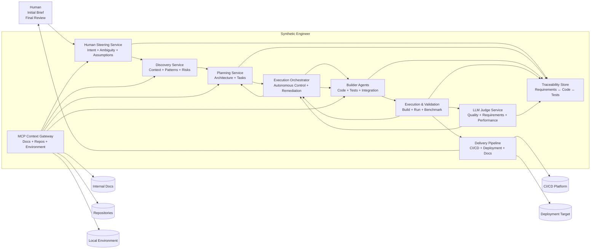
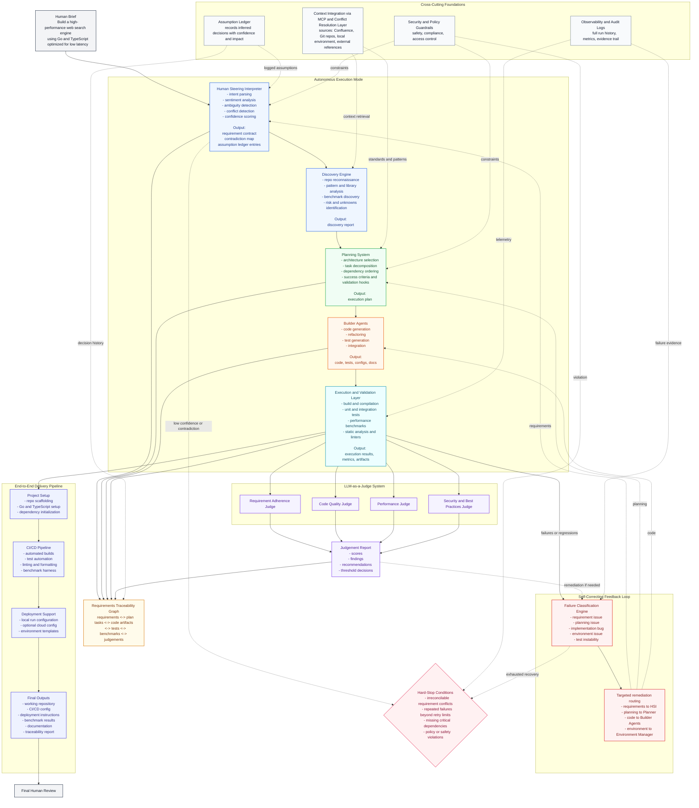

# Whiteboard Architecture

## Objective

Design an autonomous agentic system capable of building software projects end-to-end from a high-level human brief, such as:

“Build a high-performance web search engine using Go and TypeScript, optimized for low latency.”

The system must independently perform:
    Discovery
    Planning
    Implementation
    Validation
    Delivery

Human involvement is limited to:
    Initial requirement input
    Final review

## Can a one prompt end-to-end autonomous agentic system create an enterprise grade solution along with code?

The short answer is no.

The long answer:

The biggest challenges in building a system like the Synthetic Engineer are not centred on generating code; they are centred on making it reliable, autonomous and trustworthy end-to-end. You are taking vague human input and turning it into a structured plan, which means handling ambiguity, conflicting requirements and missing information without constant human intervention. Then you have to ground that plan in real-world context from sources such as documentation and repositories, which may be noisy, outdated or contradictory. From there, coordinating multiple agents to produce consistent, production-quality code is non-trivial, especially across longer workflows where drift and inconsistencies can emerge. The hardest part is building a genuine self-correcting loop: being able to diagnose whether a failure comes from requirements, planning, implementation or the environment and then correct the right layer rather than merely retrying. On top of that, validating everything through actual execution, using LLMs as judges without introducing bias and maintaining full traceability back to the original requirements are all critical to building trust. Finally, there are practical concerns such as cost, latency and reproducibility, alongside the need to ensure safety and governance. Overall, the challenge is less about intelligence in isolation and more about orchestrating a robust system that can operate autonomously in messy, real-world conditions while still producing something a human can confidently approve.

The spec based approach to GenAI goes a long way in solving the challange however is not the complete answer.

## Key Assumptions
* Cost and time is not a restraint
* Using the best leading reasioning LLMs in systems design and coding
* Extreamly high-quality content aviable for context via the MCP sources
* Software tasks can be decomposed into smaller, testable units which allows the planner and orchestrator to break work down and validate progress incrementally.
* Referance implemention can be done using GitHub copilot

## Scaling Consoderations
The architecture can scale, but only if it stops being implemented as one smart loop and becomes a distributed workflow system with explicit queues, state boundaries, worker pools, caches and degraded modes.

The first bottlenecks will not be user traffic in the abstract. They will be centralised orchestration, repeated retrieval, model throughput, verification capacity and traceability write amplification. Designing around those from the start preserves the whiteboard principles while making the system operable at higher load.

## Foundational Principles That Guide the System

### Autonomous by Default

The system operates without requiring human intervention during execution. It progresses independently unless it encounters a critical failure condition.

### Decisions Are Logged, Not Blocked

When uncertainty arises, the system makes informed assumptions and records them, rather than stopping progress.

### Real Execution Is the Source of Truth

All outputs must be validated through actual execution, testing, and measurement—never just reasoning.

### Failures Are Diagnosed, Not Retried Blindly

Every failure is analyzed to determine its root cause and routed to the correct subsystem for correction.

### Full Traceability Is Required

Every requirement must be provably linked to code, tests, and validation results.

## The Complete End-to-End Workflow
* Human provides initial brief
* Human Steering Intent (HSI) converts it into structured requirements
* Discovery Engine gathers context and insights
* Planner creates an execution strategy
* Builder Agents implement the system
* Execution layer validates outputs
* Self-Correcting Feedback Loop (SCFL) corrects any failures
* LLM-as-a-Judge System (LAJ) evaluates quality and compliance
* Requirements Traceability Graph (RTG) verifies requirement coverage
* Delivery pipeline packages the system
* Human performs final review

## The Architecture - High Level

## The Architecture - Detailed View

## How the System Operates Without Human Intervention

### Autonomous Execution Mode (AEM)

The system runs in a fully autonomous mode where:
* No intermediate approvals are required
* Work continues even under ambiguity
* Assumptions are recorded for transparency

### When the System Must Stop

Execution halts only under specific “hard-stop” conditions:
* Requirements are fundamentally contradictory and cannot be resolved
* Repeated failures exceed retry limits
* Critical dependencies are missing
* A policy or safety constraint is violated

### Assumption Ledger

All inferred decisions are stored in an Assumption Ledger, including:
* The assumption itself
* Confidence level
* Where it influenced the system

This ensures transparency without blocking progress.

## Interpreting Human Intent and Handling Ambiguity

### Human Steering Interpreter (HSI)

The HSI converts vague or incomplete human input into structured, actionable requirements.

### What It Handles
* Extracting intent from natural language
* Detecting ambiguity or missing information
* Identifying conflicting requirements
* Using sentiment to estimate confidence and urgency

### How It Resolves Uncertainty
* High confidence → automatically resolved
* Medium confidence → assumed and logged
* Low confidence → triggers a system halt

### What It Produces
* A structured Requirement Contract
* A Contradiction Map
* Confidence scores for each requirement
* Entries in the Assumption Ledger

## Discovering Context Before Any Planning Begins

### Discovery Engine

Before planning, the system performs a dedicated discovery phase to avoid uninformed decisions.

### What It Investigates
* Existing repositories for patterns and conventions
* Internal standards (e.g., Confluence documentation)
* Available libraries and dependencies
* Performance expectations (e.g., latency benchmarks)
* Risks and unknowns

### Where It Gets Information

Using Model Context Protocol (MCP) integrations, it pulls data from:
* Internal documentation systems
* Code repositories
* Local development environments
* External references

### What It Produces

A Discovery Report containing:
* Constraints and requirements context
* Candidate architectural approaches
* Identified risks
* Known unknowns
* Initial assumptions

This report becomes a required input to planning.

## Resolving Conflicts Between Context Sources

### Context Conflict Resolution Layer (CCRL)

Because multiple sources may disagree, the system includes a formal conflict resolution mechanism.

### How Conflicts Are Resolved

Sources are ranked by:
* Authority (organizational standards take precedence)
* Freshness
* Relevance

If conflicts occur:
* Compatible information is merged
* Otherwise, the highest-authority source is selected
* The decision is logged in the Assumption Ledger

Low-confidence or unreliable context is discarded entirely.

## Turning Requirements into an Executable Plan

### Planning System

The Planner converts requirements and discovery insights into a structured execution strategy.

### Responsibilities
* Breaking down the problem into tasks
* Selecting appropriate architecture
* Ordering dependencies
* Incorporating risk mitigation

### What It Produces

An Execution Plan that includes:
* Task breakdown
* Dependencies between tasks
* Success criteria
* Built-in validation checkpoints

## Building the System Through Specialized Agents

### Builder Agents

Execution is handled by specialised agents, each responsible for part of the system.

### Types of Agents
* Code generation agents
* Refactoring agents
* Test generation agents
* Integration agents

### How They Work
* Implement incrementally
* Continuously validate outputs
* Align with both the plan and requirements

## Ensuring Everything Works Through Real Execution

### Execution and Validation Layer

All generated artifacts are validated through actual execution.

### What Is Verified
* Code compiles successfully
* Tests pass
* Components integrate correctly
* Performance meets expectations (e.g., latency targets)
* Code quality standards are met

### Key Principle

If it doesn’t run successfully, it is not considered complete.

## Diagnosing and Fixing Problems Automatically

### Self-Correcting Feedback Loop (SCFL)

The system continuously monitors for failures and corrects them.

### Failure Classification Engine (FCE)

When something goes wrong, the system determines the root cause:
* Requirement issue
* Planning issue
* Implementation bug
* Environment/configuration problem
* Test instability

### How Fixes Are Applied

Each failure is routed to the correct subsystem:
* Requirements → back to HSI
* Planning → back to Planner
* Code → back to Builder Agents
* Environment → environment management

### Key Improvement

## Fixes are targeted and intelligent—not simple retries.

Evaluating Quality Using Independent AI Judges

### LLM-as-a-Judge System (LAJ)

The system uses independent AI evaluators to assess output quality.

### Types of Judges
* Requirement adherence judge
* Code quality judge
* Performance judge
* Security and best-practices judge

### How Judging Works

Each judge uses structured scoring criteria such as:
* Completeness
* Correctness
* Alignment with requirements
* Performance expectations
* Decision Rules
* All criteria must meet defined thresholds
* Disagreements trigger an adjudication step
* What It Produces

A Judgement Report tied directly to requirements.

## Proving That Requirements Are Fully Met

### Requirements Traceability Graph (RTG)

The system maintains a graph linking requirements to all outputs.
* What Is Connected
* Requirements
* Plan tasks
* Code artifacts
* Tests
* Benchmarks
* Judgement results
* Why It Matters
* Ensures nothing is missed
* Provides auditability
* Allows judges to verify full coverage

## Delivering a Complete, Usable Software Project

### End-to-End Delivery Pipeline

The system produces more than just code—it delivers a fully usable project.

### What Is Included

#### Project Setup
* Repository scaffolding
* Language/runtime configuration
* Dependency setup

#### CI/CD Pipeline
* Automated builds
* Test execution
* Linting and formatting
* Performance benchmarking

#### Deployment Support
* Local execution setup
* Optional cloud deployment configuration

#### Final Outputs
* Fully working repository
* CI/CD configuration
* Deployment instructions
* Benchmark results
* Documentation
* Traceability report